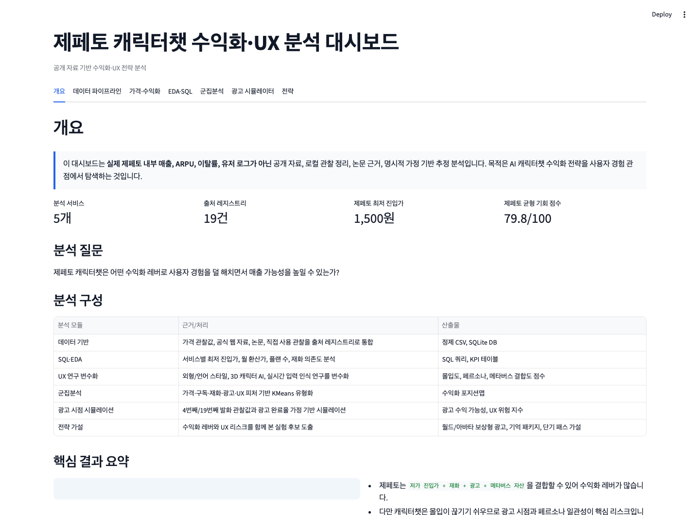

# 제페토 캐릭터챗 수익화·UX 분석 대시보드

공개 자료 기반으로 제페토 캐릭터챗의 수익화 구조, 사용자 경험 리스크, SQL 분석, 군집분석, 광고 시점 시뮬레이션을 구현한 데이터 분석 프로젝트입니다.

이 프로젝트의 핵심 질문은 다음입니다.

> 제페토 캐릭터챗은 어떤 수익화 레버로 사용자 경험을 덜 해치면서 매출 가능성을 높일 수 있는가?

## 중요 고지

이 저장소는 실제 제페토 내부 매출, ARPU, 이탈률, 광고 단가, 유저 로그를 사용하지 않습니다. 모든 분석은 공개 웹 자료, 직접 관찰한 가격·UX 메모, 공개 논문, 명시적으로 문서화한 시뮬레이션 가정에 기반합니다.

따라서 결과는 **실제 매출 예측이 아니라 공개 데이터 기반 전략 분석 및 가설 생성 결과**로 해석해야 합니다.

## 빠른 확인 방법

```bash
pip install -r requirements.txt
python3 scripts/build_database.py
streamlit run app.py
```

`streamlit` 명령어가 바로 실행되지 않으면 아래처럼 실행합니다.

```bash
python3 -m streamlit run app.py
```

실행 후 브라우저에서 아래 주소를 엽니다.

```text
http://localhost:8501
```

`localhost`는 실행한 사람의 컴퓨터에서만 열립니다. 제출용으로는 GitHub URL과 함께, 가능하면 Streamlit Cloud 배포 URL을 같이 첨부하는 것을 권장합니다. 정적 확인을 위한 대시보드 스크린샷은 아래에 포함했습니다.



## 이 프로젝트에서 보여주는 역량

| 영역 | 저장소에서 확인할 수 있는 산출물 |
| --- | --- |
| 데이터 수집 및 출처 관리 | 공개 자료와 직접 관찰 자료를 `source_registry`로 정규화 |
| 데이터 정제 | 가격 플랜, 결제 주기, 월 환산가, 재화 패키지 표준화 |
| SQL 및 DB 모델링 | SQLite DB, ERD, 재현 가능한 SQL 분석 쿼리 |
| EDA 및 KPI 설계 | 진입가, 수익화 복잡도, UX 적합도, 메타버스 결합도, 리스크 점수 산출 |
| 논문 기반 변수화 | 캐릭터 디자인, 3D 캐릭터 AI, 실시간 입력 인식, 페르소나 일관성 연구를 UX 변수로 변환 |
| 머신러닝 | 작은 표본에 맞춰 예측 회귀 대신 KMeans 기반 서비스 유형화 수행 |
| 시뮬레이션 | 광고 노출 시점별 수익 가능성과 UX 위험 비교 |
| 대시보드 커뮤니케이션 | Streamlit 탭 구조로 분석 결과를 제품 전략 가설까지 연결 |

## 프로젝트 구조

```text
.
├── app.py                         # Streamlit 대시보드
├── streamlit_app.py               # Streamlit Cloud 호환 진입점
├── src/
│   ├── data.py                    # 출처 레지스트리, 가격 정제, SQLite 생성
│   ├── clustering.py              # KMeans 군집분석
│   ├── simulation.py              # 광고 시점 시뮬레이션
│   └── charts.py                  # Plotly 차트 헬퍼
├── scripts/
│   └── build_database.py          # 정제 CSV와 SQLite DB 생성
├── sql/
│   ├── schema.sql                 # ERD와 맞춘 스키마
│   └── analysis_queries.sql       # SQL EDA 쿼리
├── docs/
│   ├── erd.md
│   ├── methodology.md
│   ├── reviewer_guide.md
│   └── ai_handoff_ko.md
├── data/
│   ├── processed/                 # 생성된 정제 CSV
│   └── zepeto_characterchat.db    # 생성된 SQLite DB
└── screenshots/
    └── dashboard_overview.png
```

## 분석 파이프라인

1. **분석 질문 정의**: 사용자 경험을 해치지 않는 수익화를 핵심 질문으로 설정
2. **수집**: 공개 웹 자료, 논문, 가격 관찰값, 직접 사용 관찰값 통합
3. **정제**: 가격, 결제 주기, 월 환산가, 재화 단위, 출처 유형, 피처 정의 표준화
4. **EDA**: 최저 진입가, 플랜 수, 재화 의존도, 광고 제거 혜택, 서비스 포지셔닝 비교
5. **ERD/DB**: `services`, `pricing_plans`, `monetization_features`, `ux_research_factors`, `ad_observations`, `simulation_assumptions`, `kpi_results`, `sources`를 SQLite로 구축
6. **SQL**: 가격, 수익화 복잡도, UX 지표, 출처 커버리지를 재현 가능한 쿼리로 산출
7. **군집분석**: 가격·수익화·UX 피처 기반 KMeans로 서비스 유형화
8. **시뮬레이션**: 멱법칙 기반 세션 길이 가정으로 광고 시점 정책 비교
9. **대시보드**: Streamlit으로 분석 결과와 전략 가설을 수용자 친화적으로 제시

## 대시보드 탭

- **개요**: 분석 질문, 공개 데이터 고지, 분석 구성, 핵심 결과
- **데이터 파이프라인**: 출처 레지스트리, ERD, SQLite 테이블 현황
- **가격·수익화**: 5개 서비스 가격 및 수익화 구조 비교
- **EDA·SQL**: SQL 쿼리 결과와 KPI 정의
- **군집분석**: KMeans 군집 결과와 수익화 포지션맵
- **광고 시뮬레이터**: 직접 관찰한 4번째/19번째 발화 광고 시점을 바탕으로 한 광고 시점 시뮬레이션
- **전략**: 제페토 적용 가설, 리스크, 다음 실험 설계

## 주요 KPI

| KPI | 의미 |
| --- | --- |
| Entry Price Index | 관찰된 최저 진입가 기준 접근성 점수 |
| Monetization Complexity Score | 구독, 재화, 광고, 단기 패스 등 수익화 구조의 복합성 |
| Metaverse Integration Score | Path Search, Action Logic, NPC Response, Technology Improvement 평균 |
| Immersion Fit Score | 캐릭터 외형과 세계관이 채팅 몰입을 돕는 정도 |
| Persona/Language Fit | 캐릭터 말투, 페르소나, 응답 스타일의 일관성 |
| Ad Revenue Potential | 광고 시점 가정에 따른 상대적 수익 가능성 |
| UX Risk Index | 수익화가 사용자 몰입을 방해할 위험 |
| Balanced Opportunity Score | 수익화 레버, UX 강점, 리스크를 함께 본 우선순위 점수 |

## 주요 출처

- [Character.AI c.ai+](https://character.ai/subscribe)
- [Replika subscription guide](https://help.replika.com/hc/en-us/articles/39551043419149-Choosing-a-Subscription)
- [ZEPETO Premium benefits](https://support.zepeto.me/hc/en-us/articles/4402066761369-What-are-Premium-Regular-Subscription-Benefits)
- [Zeta Pass announcement](https://zeta-ai.io/en/Announcements/9343)
- [생성형 AI 기반 캐릭터 챗봇 디자인에 대한 사용자 반응 유형별 분석](https://www.kci.go.kr/kciportal/ci/sereArticleSearch/ciSereArtiView.kci?sereArticleSearchBean.artiId=ART003229348)
- [메타버스 콘텐츠를 위한 3D 캐릭터 AI 시스템분석](https://www.kci.go.kr/kciportal/ci/sereArticleSearch/ciSereArtiView.kci?sereArticleSearchBean.artiId=ART003012083)
- [Display Methods of Text Input Awareness in Real Time](https://www.jstage.jst.go.jp/article/his/19/2/19_141/_article/-char/en)
- [The Design and Implementation of XiaoIce](https://arxiv.org/abs/1812.08989)
- [PersonaCLR](https://aclanthology.org/2024.sigdial-1.58/)
- [Persona-consistent dialogue research](https://aclanthology.org/2023.emnlp-main.110/)
- [AppsFlyer mid-roll ads](https://www.appsflyer.com/blog/tips-strategy/mid-roll-ads/)
- [NAVER Z](https://www.naverz-corp.com/)

## 레포지토리 메타데이터 추천

**About 영어**

Public-data analytics dashboard for ZEPETO CharacterChat monetization and UX strategy with SQL, clustering, and ad-timing simulation.

**About 한국어**

공개 자료 기반 제페토 캐릭터챗 수익화·UX 분석 대시보드: SQL, 군집분석, 광고 시점 시뮬레이션으로 사용자 경험을 해치지 않는 수익화 가설을 도출합니다.

**Topics**

`streamlit`, `python`, `sql`, `sqlite`, `data-analysis`, `eda`, `clustering`, `kmeans`, `dashboard`, `zepeto`, `monetization`, `ux-research`, `ai-character`, `character-chat`, `simulation`, `public-data`, `product-analytics`, `ad-simulation`, `metaverse`
