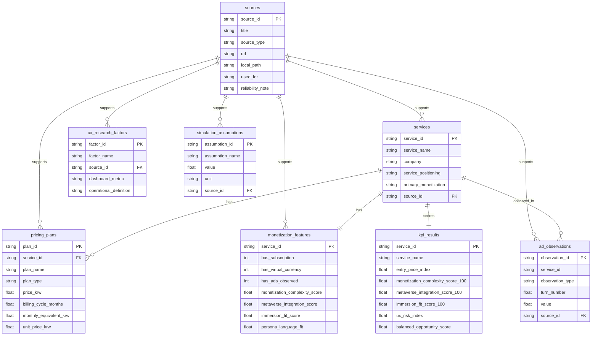

# ERD: ZEPETO CharacterChat Monetization Analytics

이 프로젝트의 DB는 실제 내부 매출 DB가 아니라 공개 자료, 논문, 직접 사용 관찰, 명시적 가정을 분석 가능한 형태로 정규화한 SQLite 데이터베이스입니다.

## 설계 의도

- `sources`: 모든 수치와 가정의 근거를 추적하기 위한 출처 레지스트리입니다.
- `pricing_plans`: 구독, 재화, 단기 패스를 같은 구조로 표준화해 월 환산가와 단위 가격을 비교합니다.
- `monetization_features`: 가격 구조와 직접 관찰을 서비스 단위 피처로 변환합니다.
- `ux_research_factors`: 논문에서 도출한 개념을 대시보드 KPI로 연결합니다.
- `ad_observations` / `simulation_assumptions`: 광고 시점 시뮬레이션의 입력값과 한계를 명확히 남깁니다.
- `kpi_results`: SQL과 대시보드에서 바로 사용할 수 있는 요약 KPI입니다.

